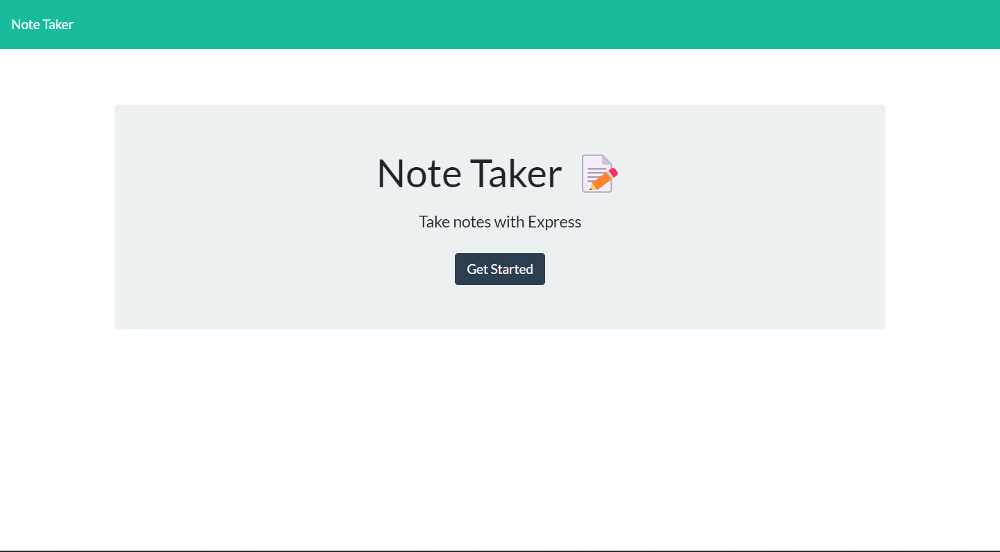

# Note-Taker

Link:
https://josuepaniagua.github.io/Note-Taker/

## Table of Contents:
* [Description](#description)
* [Installation](#installation)
* [Usage](#usage)
* [Collaborators](#collaborators)
* [Starter Code](#starter-code)

## Description
This application is called Noter Taker and it can help individuals create and save notes. It uses Express.js to save and retrieve data from JSON files. 

## Installation
Steps to follow to install weather-dashboard project:
1. Go to Gitbash and select a folder to store the project
2. Use the git clone command to clone the repo
3. Use Visual Studio to open the folder and access the project
4. Final step, enjoy the project

## Usage

## Collaborators
None

### Starter Code
https://github.com/coding-boot-camp/miniature-eureka
